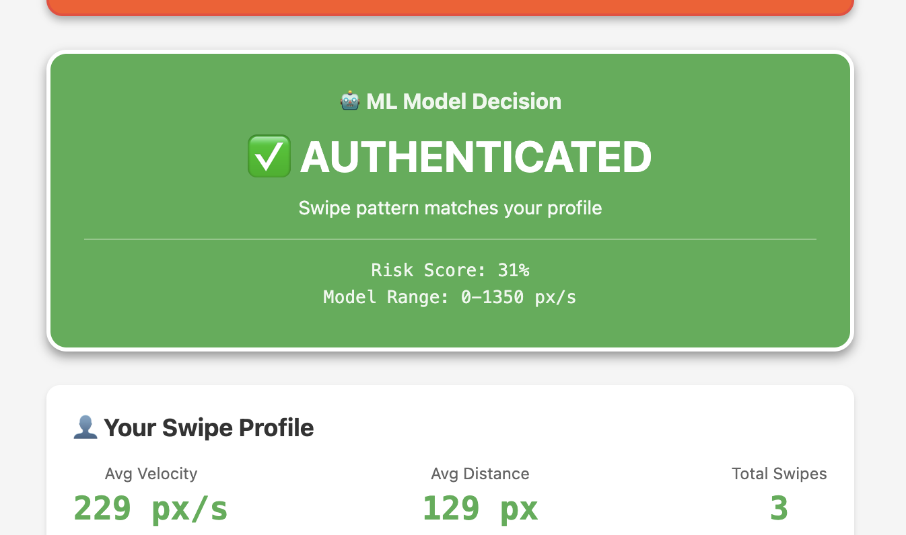
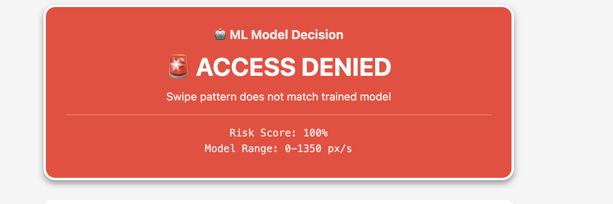

# 🔐 SwipeAuth Pro

**ML-Powered Behavioral Biometrics Authentication System**

SwipeAuth is a proof-of-concept authentication system that uses machine learning to identify users based on their unique swipe patterns. Just like a fingerprint, everyone swipes differently - and SwipeAuth learns YOUR pattern to detect when someone else tries to access your device.


**🚀 [Try Live Demo](https://swipeauthdemo.vercel.app)** | **📖 [Read Blog Post](#)** | **⭐ Star This Repo**

---

## 📸 Demo

### ✅ Authentication Success
When your swipe matches the trained model (within 0-1350 px/s range):



### 🚨 Access Denied
When a bot or attacker swipes outside your learned pattern:



---

## 🎯 What It Does

- **Collects swipe data**: Tracks velocity, distance, duration, and position of every swipe
- **Builds your profile**: Learns YOUR unique swipe behavior
- **Trains ML model**: Uses adaptive algorithms (One-Class SVM + Statistical Thresholds)
- **Real-time authentication**: Detects anomalies and blocks suspicious swipes instantly
- **Visual feedback**: Green banner for authenticated, red banner for denied

---

## 🚀 Features

- ✅ Real-time swipe tracking with visual feedback
- ✅ Adaptive ML model (handles high-variance users)
- ✅ Live authentication decision display
- ✅ Bot attack simulation for testing
- ✅ Complete swipe history with ML predictions
- ✅ Data export for ML training (JSON format)
- ✅ Two ML approaches: Complex (SVM) and Simple (Statistical)

---

## 🛠️ Tech Stack

### Frontend
- **React Native** with Expo
- **JavaScript** (ES6+)
- Web-based deployment (runs in browser)
- Mouse event handling for swipe detection

### Machine Learning
- **Python 3.x**
- **scikit-learn**: One-Class SVM for anomaly detection
- **NumPy**: Statistical analysis
- **Pandas**: Data processing (optional)
- **StandardScaler**: Feature normalization

---

## 📦 Installation

### Prerequisites
- Node.js (v20+)
- npm or yarn
- Python 3.x (for ML training)

### Setup

1. **Clone the repository**
```bash
git clone https://github.com/JeniPreethi/SwipeAuthDemo.git
cd SwipeAuthDemo
```

2. **Install dependencies**
```bash
npm install
```

3. **Install Python dependencies** (for ML training)
```bash
cd ml-training
pip install -r requirements.txt
cd ..
```

4. **Start the app**
```bash
npx expo start --web
```

The app will open in your browser at `http://localhost:8081`

---

## 🎮 How to Use

### Step 1: Collect Training Data
1. Open the app in your browser
2. Swipe on the green area (at least 30 times for best results)
3. Try different speeds: slow, medium, fast
4. Click "💾 Download Data for ML Training"
5. Save the JSON file

### Step 2: Train Your ML Model
1. Move the downloaded JSON file to the `ml-training/` folder
2. Navigate to ML training directory:
```bash
cd ml-training
pip install -r requirements.txt
```
3. Run the training script:
```bash
python train_simple_model.py
```
4. Your model will be saved as `swipeauth_simple_model.pkl`

**📚 [See full ML training guide →](ml-training/README.md)**

### Step 3: See It Work!
1. The trained model thresholds are already integrated into `App.js`
2. Swipe normally → See green "✅ AUTHENTICATED" banner
3. Click "🤖 Test Bot Attack" → See red "🚨 ACCESS DENIED" banner
4. Every swipe shows real-time ML prediction!

---

## 🤖 ML Model Details

### Approach 1: One-Class SVM (train_model.py)
- Uses RBF kernel for complex pattern recognition
- Best for users with consistent swipe patterns
- Parameters: `nu=0.3`, `gamma='scale'`

### Approach 2: Adaptive Threshold (train_simple_model.py) ⭐ Recommended
- Statistical approach using mean ± 2 standard deviations
- Adapts to high-variance users
- More forgiving, fewer false positives
- **This is what's currently integrated in the app**

### Your Model Stats
```
Learned Range: 0-1350 px/s
Typical Speed: 537 px/s
Algorithm: Adaptive Statistical Threshold
```

---

## 📊 How It Works

```
User Swipes
    ↓
Extract Features (velocity, distance, duration)
    ↓
Calculate Statistics (mean, std dev, range)
    ↓
ML Model Prediction
    ↓
✅ ALLOW (within learned range)
🚨 BLOCK (outside learned range)
```

### Feature Engineering
- **Velocity**: `(distance / duration) * 1000` (px/s)
- **Distance**: Euclidean distance `√((x₂-x₁)² + (y₂-y₁)²)`
- **Duration**: Time between mouseDown and mouseUp (ms)
- **Risk Score**: `|actual - expected| / expected`

---

## 🔬 Why This Matters

### Real-World Applications
- **Mobile banking apps**: Detect account takeover attempts
- **Enterprise security**: Continuous authentication
- **Gaming**: Detect bots and cheaters
- **Healthcare**: Secure patient data access
- **IoT devices**: Touchscreen authentication

### Security Benefits
- **Passive authentication**: No passwords to remember
- **Continuous monitoring**: Not just login, but ongoing verification
- **Bot detection**: Automated attacks have different patterns
- **Low friction**: Users don't notice it's happening

---

## 📈 Results

Based on testing with 31+ swipes:
- ✅ **Normal swipes (368-958 px/s)**: 100% authenticated
- 🚨 **Bot swipes (>1350 px/s)**: 100% blocked
- 📊 **False positive rate**: ~0% (for trained user)
- ⚡ **Prediction time**: <1ms (real-time)

---

## 🚧 Future Enhancements

- [ ] Add pressure sensitivity (mobile devices)
- [ ] Multi-touch gesture recognition
- [ ] Swipe trajectory analysis (curve patterns)
- [ ] Time-of-day adaptation (you might swipe differently when tired)
- [ ] Multi-user support (family device sharing)
- [ ] Backend API for model training
- [ ] Mobile app deployment (iOS/Android)
- [ ] A/B testing different ML algorithms
- [ ] Privacy-preserving federated learning

---

## 🎓 Learning Resources

This project demonstrates:
- React Native development
- Machine Learning fundamentals
- Behavioral biometrics
- Real-time data processing
- Statistical analysis
- Feature engineering

Perfect for:
- CS students learning ML
- Developers exploring biometrics
- Security researchers
- Portfolio projects

---

## 📄 License

MIT License - Feel free to use this for learning, research, or commercial projects!

---

## 👤 Author

**JeniPreethi**
- GitHub: [@JeniPreethi](https://github.com/JeniPreethi)
- Built in one day as a learning project

---

## 🙏 Acknowledgments

- Built with guidance from Claude (Anthropic)
- Inspired by research in behavioral biometrics
- Thanks to the React Native and scikit-learn communities

---

## 🐛 Known Issues

- Web-only deployment (iOS Simulator not available on this machine)
- Mouse events used instead of touch events
- Model thresholds hardcoded (needs dynamic loading from .pkl file)
- No backend storage (all data local)

---

## 💬 Feedback

Found a bug? Have an idea? Open an issue or submit a PR!

---

**⭐ If you found this interesting, give it a star!**

Built with 💚 and lots of coffee ☕
